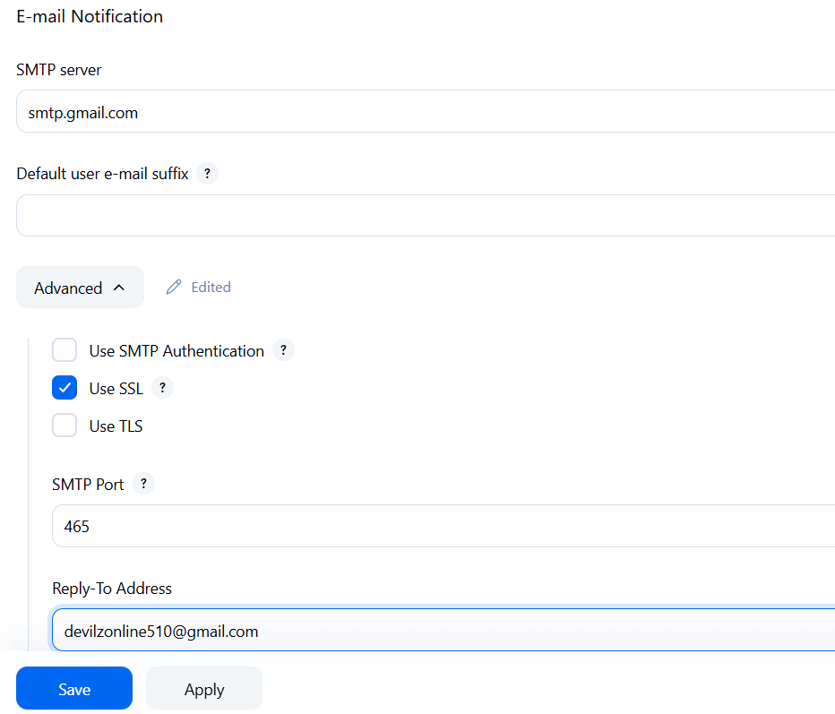

- To send email whenever a deployment is done or via post first we need to configure jenkins
- go to manage jenkins > system > E-mail Notification

        
- Now in the email which you want to send to in that go to app passwords and create one 
- enable Use SMTP authentication option and enter username (mailid) password (app password)
- Now in last enter your mail id and click on test configuration
- if you dont know how to write the code then select the pipeline there there is an option on left side pipeline syntax
- In select the option for example mail there write TO address, subject etc at bottom click generate pipeline script you will get the code