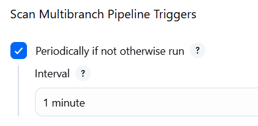
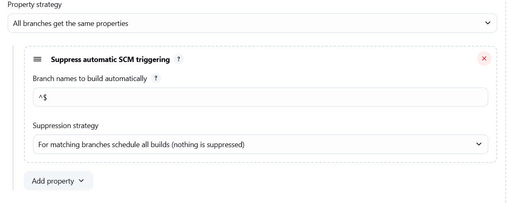

- A multi-branch pipeline in Jenkins allows you to create and manage separate pipelines for each branch in your repository
- Here it scans the branches only if jenkins file is available or if you need someother name you can do it in scanning section while creating
- first time if only it will scan all the branches that is having jenkins file then later if you create a new branch with jenkins file it will not detect for that you have to click on **Scan Multibranch Pipelines Now** on the left hand side options.
            
- enable this option it will scan the branches periodically and keeps and removes whichever is having jenkins file or not
- if the first time it scans a branch and has jenkinsfile in it and later removed the Jenikinsfile in that branch then it will remove that branch when it scans
- Bydefault this process is triggering all the jobs after scanning all the branches but it should not be like that
- 
- This options make sure that it is only scannning the branches but not building jobs
